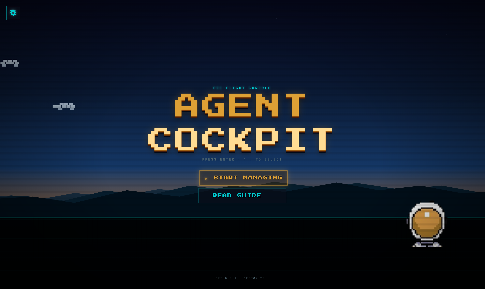
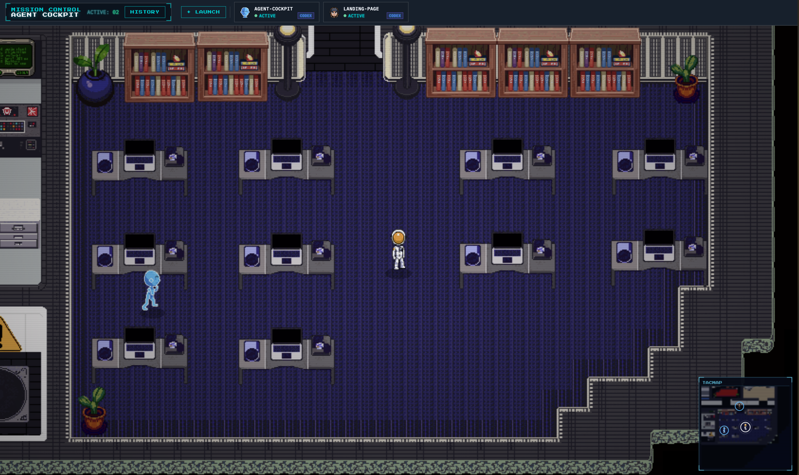

# Agent Cockpit

> A local-first control room for developers running multiple Claude Code and Codex agents at the same time.

Agent Cockpit turns parallel coding-agent sessions into something you can see, manage, approve, replay, and review from one browser UI. The top layer is a pixel-art office where every active agent becomes a character. Under it is a serious operations plane for approvals, diffs, timeline replay, memory, chat, and session history.




## Why this exists

Running one agent is easy. Running several at once gets messy fast.

The hard part is knowing:

- what each agent is doing right now
- which session needs attention
- which approval is safe to grant
- what changed in the repository
- where to find the session again later

Agent Cockpit replaces terminal sprawl with one local interface for live status, unified approvals, diffs, memory, replay, history, and direct chat.

## What it does



### Office mode

The default view is a 2D pixel-art office rendered on Canvas.

- Active sessions appear as animated agent characters.
- You move your player character with WASD or arrow keys.
- Agents can show status, pending approvals, provider, last tool, and elapsed time.
- Clicking an agent opens its full session popup.
- The map has camera follow, 2x zoom, collision physics, minimap, audio, and character selection.

### Operations control plane

Each agent popup exposes the practical tools needed to supervise work:

- **Approvals** - Claude Code and Codex approvals in one inbox, with risk classification.
- **Timeline** - every event in order: plans, tool calls, commands, file changes, approvals, memory, completion, and failures.
- **Diffs** - per-file review of what the agent changed.
- **Memory** - project memory from provider-specific files in one editable surface.
- **Chat** - send messages to daemon-launched sessions.
- **History** - reopen past sessions and compare outcomes.

## Who it is for

Agent Cockpit is built for developers who already use coding agents in real work:

- solo developers running multiple Claude Code or Codex sessions
- small technical teams experimenting with agent-assisted development
- open-source maintainers who want local visibility before trusting automation
- builders who want a demoable, visual way to understand what agents are doing

It is not a replacement for Claude Code or Codex. It is the missing control layer above them.

## Quick start

### Requirements

- Node.js 22 or newer
- pnpm
- Claude Code CLI
- Codex CLI, optional but supported
- A modern desktop browser

### Run with npx

```bash
npx @agentcockpit/agent-cockpit
```

The daemon serves the browser UI on:

```text
http://localhost:54321
```

### Run from source

```bash
git clone https://github.com/agent-cockpit/agent-cockpit.git
cd agent-cockpit
pnpm install
pnpm dev
```

The source dev workflow runs the daemon and UI from the pnpm workspace.

## Session setup

Agent Cockpit handles provider wiring for sessions launched from the UI.

For Claude Code, the daemon generates the required temporary settings and starts Claude with the right lifecycle hooks. There is no manual hook setup.

For Codex, the daemon starts and talks to Codex through the supported local process integration. Externally started sessions are detected when possible, but daemon-launched sessions provide the richest experience, including chat and termination controls.

## How it works

```text
Claude Code hooks        Codex app-server / CLI sessions
        |                         |
        v                         v
  Provider adapters normalize events and approvals
        |
        v
  Local Node.js daemon
  - SQLite event store
  - approval queue
  - memory and history APIs
  - WebSocket broadcast
        |
        v
  React + Canvas browser UI
  - Office map
  - agent popups
  - approvals, timeline, diffs, memory, chat, history
```

Everything is local-first. Session data is stored on your machine, not in a hosted backend.

## Architecture

The repository is a pnpm monorepo:

```text
agent-cockpit/
├── packages/
│   ├── daemon/      # Node.js daemon, SQLite, provider adapters, WebSocket server
│   ├── ui/          # React + Vite + Canvas browser app
│   └── shared/      # shared event, approval, and WebSocket types
├── assets/raw/      # source sprites, icons, map exports, generated art
├── docs/images/     # README screenshots
├── scripts/         # sprite, map, and asset pipeline helpers
└── .planning/       # product requirements, roadmap, research, phase notes
```

### Daemon

- Node.js and TypeScript
- SQLite through `better-sqlite3`
- WebSocket transport through `ws`
- Claude Code HTTP hook adapter
- Codex app-server / CLI adapter
- append-only event persistence
- approval timeout handling

### UI

- React and Vite
- Zustand for WebSocket-driven state
- Canvas 2D for the office map and sprites
- Radix UI for dialogs, tabs, and hover cards
- Tailwind CSS for styling

## Usage

1. Start Agent Cockpit.
2. Open `http://localhost:54321`.
3. Launch a Claude Code or Codex session from the `+ Launch` button.
4. Watch active sessions appear on the office map.
5. Open an agent to review approvals, events, diffs, memory, artifacts, and chat.
6. Use History to reopen previous sessions and audit what happened.

## Scripts

| Command | Purpose |
|---------|---------|
| `pnpm dev` | Run all workspace dev servers |
| `pnpm test` | Run tests |
| `pnpm build` | Build the UI |
| `pnpm typecheck` | Type-check the monorepo |
| `pnpm sync-map` | Sync map assets into the UI public directory |
| `pnpm copy-faces` | Export character face portraits |
| `pnpm --filter @agentcockpit/agent-cockpit dev` | Run daemon in watch mode |
| `pnpm --filter @cockpit/ui dev` | Run Vite UI dev server |

## Project status

### v1.0 complete

- daemon core with SQLite and WebSocket streaming
- Claude Code adapter
- Codex adapter
- session management
- Office mode
- Ops panels
- unified approval inbox
- timeline and replay
- diff and artifact review
- memory panel
- session history and comparison
- provider-native session launch
- session termination controls
- session chat for daemon-launched sessions
- character picker and agent face cards

### v1.1 in progress

The current milestone is polishing Office mode into a richer 2D pixel-art control room:

- Canvas game loop
- player movement
- camera and minimap
- map rendering
- collision physics
- NPC behavior
- ambient audio and sound effects
- walking sprites for all 10 characters
- sidebar design overhaul

Still planned:

- zone-based NPC movement
- save and load
- HUD overlays
- particle effects
- real PTY terminal streaming in the popup

## Roadmap

Near-term:

- NPCs move to workstations or approval areas based on session state
- quick save / quick load
- HUD approval counter and pause menu
- particle feedback for interactions and session results
- embedded terminal streaming

Future:

- labels and tags
- token, time, and cost counters
- Battle Mode for comparing Claude and Codex on the same task
- approval policy rules
- branch-per-session workflows
- LAN viewing
- Slack and Discord notifications
- plugin SDK for additional providers

## Known limitations

- Local-first only: no cloud sync or remote access.
- Desktop-first: the map and controls are designed for large screens.
- Externally attached sessions can be approval-only; full chat and termination require daemon-launched sessions.
- Browser audio starts only after a user interaction.
- Codex support depends on the installed Codex CLI and app-server behavior.
- Windows PTY launch requires native build prerequisites for `node-pty`.

## Troubleshooting

### Session does not appear

- Confirm the daemon is running.
- Launch the session from Agent Cockpit when you need full chat and lifecycle control.
- Check daemon logs for provider startup or ingest errors.
- For Codex, confirm the Codex CLI is installed and available on PATH.

### Approvals do not appear

- Check the browser WebSocket connection.
- Confirm the daemon is receiving provider events.
- For externally started sessions, try launching the session from Agent Cockpit so provider hooks are installed automatically.

### UI cannot connect to the daemon

- Open `http://localhost:54321`.
- Restart Agent Cockpit if the browser was opened before the daemon finished starting.

### Sprites or map do not load

```bash
pnpm sync-map
pnpm copy-faces
```

## Contributing

The most valuable areas right now:

- NPC zone movement
- save/load system
- HUD and pause menu
- particle effects
- PTY terminal streaming
- notification wiring
- search in history
- new provider adapters
- Windows QA

Before contributing, read:

- `.planning/PROJECT.md`
- `.planning/REQUIREMENTS.md`
- `.planning/ROADMAP.md`
- `.planning/STATE.md`

## License

MIT
